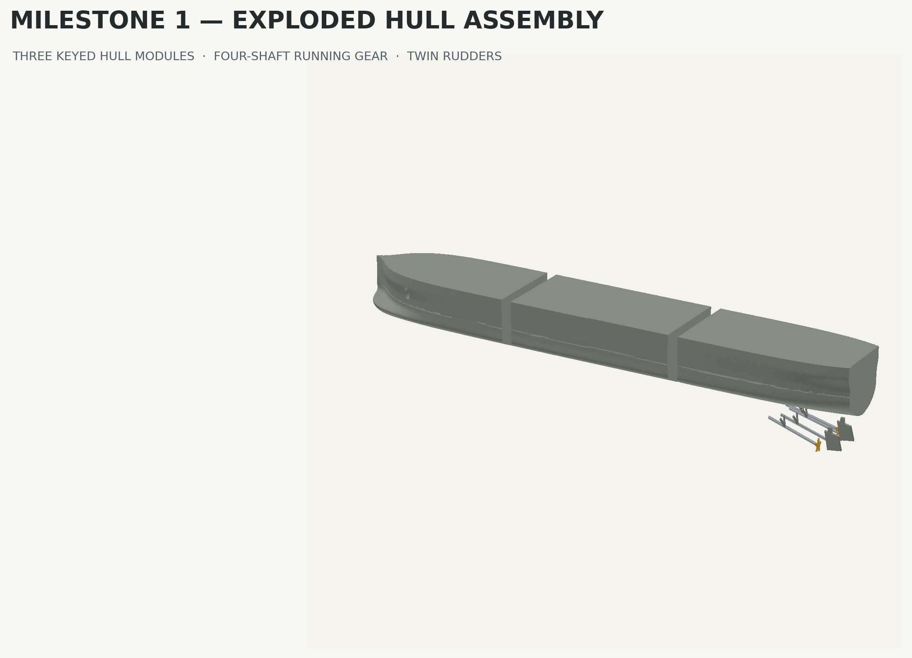

# Hull Assembly Guide — v0.1.0

## Inventory

- 3 hull modules: bow, midship, stern
- 4 shaft lines: 1 port outer, 2 port inner, 3 starboard inner, 4 starboard outer
- 8 A-bracket struts: `P` and `S` for each shaft line
- 4 five-blade propellers, matched by shaft number
- 2 rudders: port and starboard

Total: 21 printed parts. No screws, magnets, rods, inserts, or other hardware are required.

## Adhesive and tools

Use a PLA-compatible thin/medium cyanoacrylate or a purpose-made PLA solvent adhesive. Use only enough adhesive to wet the concealed joint. Recommended aids: 400–600 grit abrasive, a flat surface, low-tack tape, tweezers, and the printed paper alignment views in `Hull_Drawings.pdf`.

## Sequence

1. Remove brim only; do not sand the keyed faces until after a dry fit.
2. Identify bow (`Hull_Module_1`), midship (`Hull_Module_2`), and stern (`Hull_Module_3`). The two asymmetric keys prevent an inverted or mirrored fit.
3. Dry-fit module 1 into module 2. The seam should close by hand without force. If required, polish only the male key faces.
4. Apply adhesive inside the two female sockets, join the modules on a flat surface, and confirm the top interface remains coplanar. Let cure fully.
5. Repeat for module 2 to module 3.
6. Insert each shaft root into its numbered concealed groove. Do not glue the propeller yet. The shaft hex facet faces the print bed in its supplied STL; assembled rotational orientation is controlled by its root socket.
7. Fit each `P`/`S` A-bracket between its shaft and matching hull socket. Glue the hull end first, then wick a minimal amount of adhesive into the shaft contact.
8. Slide the matching propeller onto the shaft tip. The blind bore centers it automatically. Keep all four propeller disks approximately normal to the shaft line.
9. Insert `Rudder_Port` and `Rudder_Starboard` upward into their concealed stern slots. Confirm they are parallel in plan and side elevation before glue cures.
10. Inspect the engraved waterline, anchor pockets, seam fairness, and running-gear symmetry under raking light.

## Acceptance

- Top interface is flat across both seams.
- No visible adhesive appears on exterior surfaces.
- Four propellers rotate visually on four distinct shaft centerlines.
- Rudders are parallel and symmetric.
- The model rests only on a padded cradle until a later display-base milestone; do not place it on propellers or rudders.

