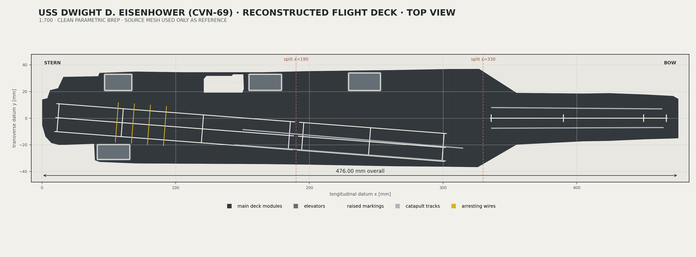

# CVN-69 Flight-Deck Reconstruction — Review Package

This package is a clean, scripted OpenCascade/FreeCAD reconstruction of the USS *Dwight D. Eisenhower* flight deck at 1:700. The source STL triangles were used only for numerical bounds, silhouettes, and feature locations; no source mesh was repaired, converted to a solid, or reused in an export.



## Scope

Included:

- 476.00 mm source-traced deck planform with stern, bow, angled landing-area geometry, four elevator locations, and island opening
- three glue-keyed main-deck modules
- four elevator inserts
- seven connected raised-marking parts
- four catapult-track parts
- four arresting-wire parts

Excluded by design: island geometry, weapons, aircraft, hull redesign, and ocean base.

## Deliverables

| Deliverable | Location |
|---|---|
| Editable FreeCAD source | [`CAD/FreeCAD/CVN69_Flight_Deck_Reconstruction.FCStd`](CAD/FreeCAD/CVN69_Flight_Deck_Reconstruction.FCStd) |
| Master parameters | [`CAD/Python/deck_parameters.py`](CAD/Python/deck_parameters.py) |
| Deterministic generator | [`Scripts/build_flight_deck.py`](Scripts/build_flight_deck.py) |
| STEP assembly | [`STEP/CVN69_Flight_Deck_Assembly.step`](STEP/CVN69_Flight_Deck_Assembly.step) |
| Individual print-oriented STL solids | [`STL/`](STL/) |
| Assembly and print-plate 3MF files | [`3MF/`](3MF/) |
| Individual 3MF solids | [`3MF/Individual/`](3MF/Individual/) |
| Top render | [`Render/CVN69_Flight_Deck_Top.png`](Render/CVN69_Flight_Deck_Top.png) |
| Isometric render | [`Render/CVN69_Flight_Deck_Isometric.png`](Render/CVN69_Flight_Deck_Isometric.png) |
| Source visual/numerical inventory | [`QA/Source_STL_Inventory.md`](QA/Source_STL_Inventory.md) |
| Dimensional QA | [`QA/Dimensional_QA.md`](QA/Dimensional_QA.md) |
| Mesh/BRep/STEP/3MF QA | [`QA/Mesh_Validation.md`](QA/Mesh_Validation.md) |
| Bambu Studio independent check | [`QA/BambuStudio_Validation.md`](QA/BambuStudio_Validation.md) |

## Print design

- 0.4 mm nozzle target
- main-deck thickness: 3.0 mm
- minimum structural wall/shelf: 1.2 mm
- minimum raised detail: 0.50 mm wide × 0.35 mm high
- elevator fit clearance: 0.25 mm per side
- glue-key top skin: 1.55 mm over the underside socket
- largest part: 197.0 × 69.81 × 3.0 mm
- main-deck plate: 197.0 × 217.95 × 3.0 mm
- detail plate: 210.90 × 170.39 × 1.8 mm

All individual STL/3MF exports are translated to z = 0. The assembly STEP/3MF and FCStd retain assembled coordinates.

## Glue-only assembly

See [`Assembly/Glue_Only_Assembly.md`](Assembly/Glue_Only_Assembly.md). Dry-fit the two keyed seams and the four elevator shelves before applying adhesive. Raised details are separate color parts and should be installed after the three main modules are aligned and glued.

## Build and validation

Run from the repository root:

```sh
/Applications/FreeCAD.app/Contents/Resources/bin/FreeCADCmd -c \
  "globals()['__file__']='Project/FlightDeck/Scripts/build_flight_deck.py'; exec(compile(open(__file__, encoding='utf-8').read(), __file__, 'exec'))"

python3 Project/FlightDeck/Scripts/inventory_sources.py
python3 Project/FlightDeck/Scripts/render_flight_deck.py
python3 Project/FlightDeck/Scripts/run_bambu_checks.py

/Applications/FreeCAD.app/Contents/Resources/bin/FreeCADCmd -c \
  "globals()['__file__']='Project/FlightDeck/Scripts/validate_flight_deck.py'; exec(compile(open(__file__, encoding='utf-8').read(), __file__, 'exec'))"
```

The recorded review run passed 52 mesh/package/geometry checks, 18 dimensional checks, and Bambu Studio inspection of 47 exported STL/3MF files.

## Source boundary

The optimized v0.4 archive contains separated longitudinal reference bands, many disconnected components, and several non-manifold edges. Missing x intervals were therefore faired between traced deck-cap control points. `Project/STL` was the only pre-existing STL package in the workspace and is inventoried in full; no second original-source archive was present in the workspace or Downloads at build time. This limitation is recorded in the inventory and QA reports.

