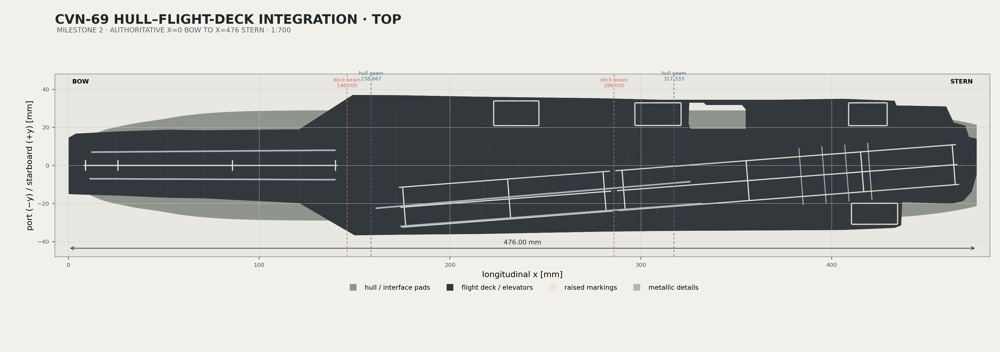

# CVN-69 Milestone 2 — Hull–Flight-Deck Integration

Milestone 2 converts the approved Milestone 1 hull and approved flight-deck review package into one coordinate-controlled, mechanically compatible, glue-only assembly. The approved external hull shape and flight-deck planform are not rebuilt or overwritten.



## Authoritative coordinate system

- X: longitudinal, x = 0 mm at the bow and x = 476 mm at the stern
- Y: port negative to starboard positive
- Z: vertical from the hull keel datum
- deck underside: z = 31.50 mm
- hull and deck centerlines: y = 0

The approved hull already uses this system. The approved deck uses the opposite longitudinal direction, so integration applies `x_authoritative = 476 - x_deck_source`, preserves y, and translates z by 31.50 mm.

## Interface decision

The deck seats directly on the hull-top datum, providing a continuous hidden glue/support plane wherever the two approved footprints overlap. Twelve separate 6.00 × 6.00 × 2.40 mm printed landing pads engage paired shallow sockets at six x stations. Each socket has 0.25 mm clearance per side.

- hull socket depth: 1.20 mm
- pad protrusion above hull: 1.20 mm
- deck socket depth: 1.45 mm
- vertical pad-tip clearance: 0.25 mm
- remaining deck top skin: 1.55 mm
- no feature penetrates the visible deck
- sockets are open and only 6.50 mm wide, avoiding trapped cavities and long unsupported roofs

Physical qualification status: **PASS**. The interface coupon was printed at 100% scale with a 0.40 mm nozzle, 0.16 mm layers, three walls, 0.00 mm XY compensation, and 0.15 mm elephant-foot compensation. The parts assembled by hand and seated correctly. The production interface dimensions are frozen under [`QA/Production_Interface_Freeze.md`](QA/Production_Interface_Freeze.md).

Deck seams transform to x = 146 and 286 mm. Hull seams remain x = 158.667 and 317.333 mm. The staggered offsets prevent coincident weak planes and leave each deck seam supported by a continuous hull module.

## Deliverables

| Deliverable | Location |
|---|---|
| Editable FreeCAD assembly | [`CAD/FreeCAD/CVN69_Hull_Deck_Integration.FCStd`](CAD/FreeCAD/CVN69_Hull_Deck_Integration.FCStd) |
| Integration parameters | [`CAD/Python/integration_parameters.py`](CAD/Python/integration_parameters.py) |
| Deterministic build | [`Scripts/build_hull_deck_integration.py`](Scripts/build_hull_deck_integration.py) |
| Assembly STEP | [`STEP/CVN69_Hull_Deck_Assembly.step`](STEP/CVN69_Hull_Deck_Assembly.step) |
| Production STLs | [`STL/`](STL/) |
| Bambu-ready 3MF files | [`3MF/`](3MF/) |
| Integration drawings | [`Docs/Hull_Deck_Integration_Drawings.pdf`](Docs/Hull_Deck_Integration_Drawings.pdf) |
| Printing guide | [`Docs/Hull_Deck_Printing_Guide.pdf`](Docs/Hull_Deck_Printing_Guide.pdf) |
| Glue-only assembly guide | [`Assembly/Glue_Only_Assembly.md`](Assembly/Glue_Only_Assembly.md) |
| Dimensional QA | [`QA/Dimensional_QA.md`](QA/Dimensional_QA.md) |
| Mesh validation | [`QA/Mesh_Validation.md`](QA/Mesh_Validation.md) |
| Interference report | [`QA/Interference_Report.md`](QA/Interference_Report.md) |
| Bambu Studio validation | [`QA/BambuStudio_Validation.md`](QA/BambuStudio_Validation.md) |
| Physical coupon PASS | [`QA/Physical_Coupon_Result.md`](QA/Physical_Coupon_Result.md) |
| Production interface freeze | [`QA/Production_Interface_Freeze.md`](QA/Production_Interface_Freeze.md) |

## Production organization

- `Print_Plate_01_Hull.3mf`: three socketed hull modules and approved running gear
- `Print_Plate_02_Deck.3mf`: three underside-socketed deck modules
- `Print_Plate_03_Details.3mf`: approved deck details plus twelve interface pads
- `Interface_Test_Coupon.3mf`: one male and one female interface sample

Material assignments are object-based and do not depend on AMS slot numbers:

- hull and pads: Bambu PLA Matte Ash Gray
- flight deck and elevators: Bambu PLA Matte Charcoal
- raised markings: Bambu PLA Matte Ivory White
- metallic details: Bambu PLA Silk Silver

## Deterministic workflow

Run from the repository root:

```sh
/Applications/FreeCAD.app/Contents/Resources/bin/FreeCADCmd -c \
  "globals()['__file__']='Project/Integration/Scripts/build_hull_deck_integration.py'; exec(compile(open(__file__, encoding='utf-8').read(), __file__, 'exec'))"

python3 Project/Integration/Scripts/render_hull_deck_integration.py
python3 Project/Integration/Scripts/run_bambu_integration_checks.py

/Users/Yun.Hu@blueshieldca.com/.cache/codex-runtimes/codex-primary-runtime/dependencies/python/bin/python3 \
  Project/Integration/Scripts/generate_integration_documents.py

/Applications/FreeCAD.app/Contents/Resources/bin/FreeCADCmd -c \
  "globals()['__file__']='Project/Integration/Scripts/validate_hull_deck_integration.py'; exec(compile(open(__file__, encoding='utf-8').read(), __file__, 'exec'))"
```

This is an unreleased review milestone. No release tag is created.
