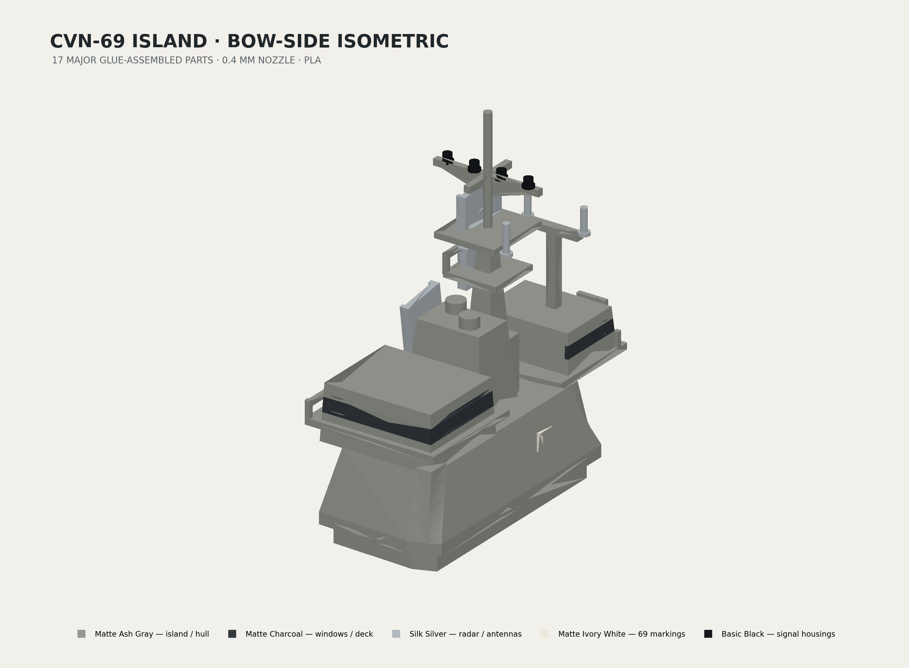

# CVN-69 Milestone 3 — Island Reconstruction and Integration

Milestone 3 is a new, deterministic parametric FreeCAD reconstruction of the USS *Dwight D. Eisenhower* island, frozen to the 2023–2024 deployment configuration. Source STL triangles are not reused. The approved hull, flight deck, coordinate system, opening, and twelve Milestone 2 hull/deck landing-pad interfaces remain unchanged.



## Engineering basis

- authoritative deck top: z = 34.50 mm, imported from Milestone 2
- approved opening: transformed directly from `deck_parameters.py`
- interface: asymmetric concealed plug, 0.25 mm clearance per side, 2.40 mm insertion
- hidden flange: 0.90 mm perimeter with four open 0.60 × 0.35 mm glue channels
- overall island/mast height above deck: 43.50 mm
- production breakdown: 17 major island parts plus two interface-coupon parts
- target: 0.4 mm nozzle, PLA, glue-only, no paint required

All photo-informed geometry is identified as approximate in [`References/Configuration_Audit.md`](References/Configuration_Audit.md). Exact public dimensions were unavailable for most island features; this package does not claim shipyard accuracy.

## Deliverables

| Deliverable | Location |
|---|---|
| FreeCAD source | [`CAD/FreeCAD/CVN69_Island.FCStd`](CAD/FreeCAD/CVN69_Island.FCStd) |
| Parameters | [`CAD/Python/island_parameters.py`](CAD/Python/island_parameters.py) |
| Deterministic build | [`Scripts/build_island.py`](Scripts/build_island.py) |
| Island STEP | [`STEP/CVN69_Island_Assembly.step`](STEP/CVN69_Island_Assembly.step) |
| Interface coupon STEP | [`STEP/CVN69_Island_Interface_Coupon.step`](STEP/CVN69_Island_Interface_Coupon.step) |
| Hull/deck/island review STEP | [`STEP/CVN69_Hull_Deck_Island_Review.step`](STEP/CVN69_Hull_Deck_Island_Review.step) |
| Print-oriented STLs | [`STL/`](STL/) |
| Named-object 3MF files | [`3MF/`](3MF/) |
| Assembly OBJ/MTL | [`OBJ/CVN69_Island_Assembly.obj`](OBJ/CVN69_Island_Assembly.obj) |
| Required renders | [`Render/`](Render/) |
| Glue-only assembly guide | [`Assembly/Glue_Only_Island_Assembly.md`](Assembly/Glue_Only_Island_Assembly.md) |
| Drawings and print documents | [`Docs/`](Docs/) |
| Geometry and package QA | [`QA/`](QA/) |

## 3MF organization

- `CVN69_Island_Assembly.3mf`: assembled island with separate named/material objects
- `Print_Plate_01_Island_Body.3mf`: foundation, bridge, PriFly, and uptake
- `Print_Plate_02_Mast_Radar.3mf`: main/secondary masts, yardarm, and three radar arrays
- `Print_Plate_03_Antennas_Details.3mf`: window inserts, ladder, antennas, signal housings, and markings
- `Island_Interface_Test_Coupon.3mf`: full-geometry male and female coupon parts
- `CVN69_Hull_Deck_Island_Review.3mf`: non-production integrated review model

Every production STL is exported in its documented orientation with minimum z = 0. The assembly/review 3MF files are not print plates.

## Deterministic workflow

Run from the repository root:

```sh
python3 Project/Island/Scripts/audit_island_reference.py

/Applications/FreeCAD.app/Contents/Resources/bin/FreeCADCmd -c \
  "globals()['__file__']='Project/Island/Scripts/build_island.py'; exec(compile(open(__file__, encoding='utf-8').read(), __file__, 'exec'))"

python3 Project/Island/Scripts/render_island.py

/Users/Yun.Hu@blueshieldca.com/.cache/codex-runtimes/codex-primary-runtime/dependencies/python/bin/python3 \
  Project/Island/Scripts/generate_island_documents.py

python3 Project/Island/Scripts/run_bambu_island_checks.py

/Applications/FreeCAD.app/Contents/Resources/bin/FreeCADCmd -c \
  "globals()['__file__']='Project/Island/Scripts/validate_island.py'; exec(compile(open(__file__, encoding='utf-8').read(), __file__, 'exec'))"
```

This is Milestone 3 only. Weapons, aircraft, deck vehicles, ocean base, display stand, electronics, and a full-ship production release remain out of scope. No v1.0 tag is created.
