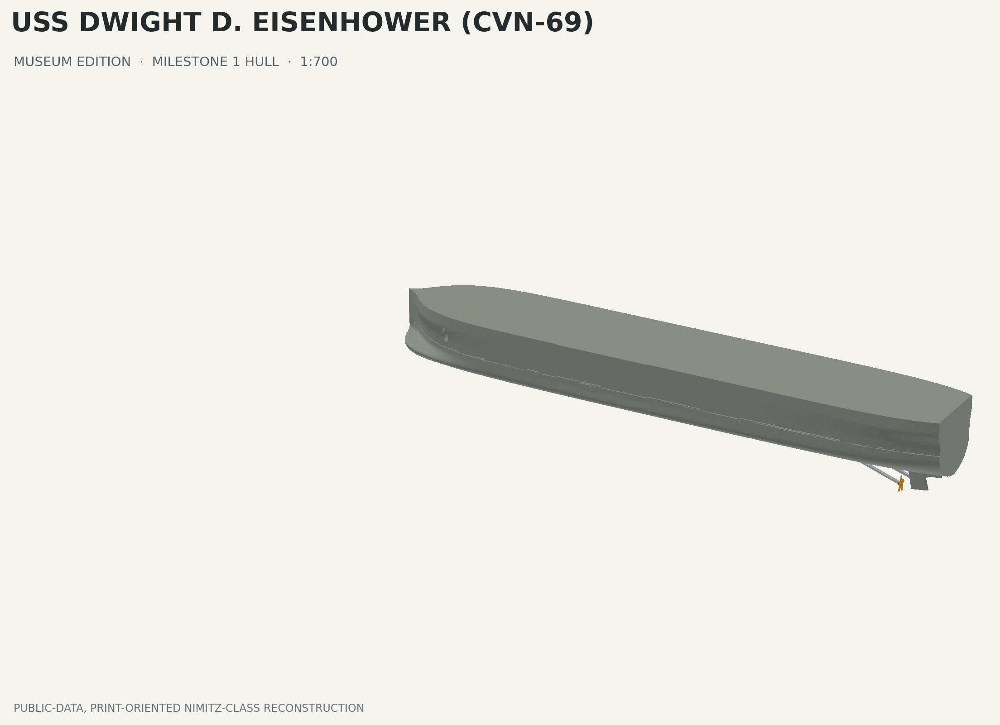

# USS Dwight D. Eisenhower (CVN-69) — Museum Edition

## Approved baseline through Milestone 5

The immutable production baseline used by Milestone 6 is `origin/main` at `9a80cfa`. It contains Milestone 3 island reconstruction (`70fe661`), the physically qualified Milestone 2 deck-to-hull coupon record (`1afb7cf`), the Milestone 4 defensive/deck-edge package, the isolated propeller print-plate correction (`05805a6`), and the Milestone 5 AirWing package. The printed coupon passed at 100% scale with 0.25 mm clearance per side; those production interface dimensions remain frozen. The Milestone 5 AirWing physical first article remains NOT RUN.

Milestone 6 flight-deck vehicles and aviation support equipment are available under [`DeckVehicles/`](DeckVehicles/README.md). Seven public-evidence-supported families are reconstructed as new parametric OpenCascade geometry: A/S32A-49 tow tractor, P-25A firefighting vehicle, MSU-200NAV service cart, carrier tow bar, maintenance ladder, wheel-chock group, and portable extinguisher group. The package includes 16 production solids, seven real-slice-validated plates, configurable 14/24/32-object support layouts coordinated with the approved AirWing, integrated review exports, 45 renders, five PDFs, and strict geometry/layout/Bambu QA. No approved Milestone 1–5 file or frozen ship interface is changed; no release tag is created. The Milestone 6 physical first article is NOT RUN.

Milestone 5 carrier-air-wing reconstruction is available under [`AirWing/`](AirWing/README.md). It adds 48 new parametric production objects covering 25 spread/folded/launch or rotor-state variants for the nine officially confirmed CVW-3 unit/type combinations from the 2023-10-14 through 2024-07-14 deployment. It includes configurable 16/32/36-aircraft layouts, ten real-slice-validated print plates, clean assembly and integrated review exports, twenty-two renders, five PDFs, and strict BRep/STEP/mesh/package/interference/Bambu QA. Approved Milestones 1–4 and the frozen physical interface remain unchanged; no release tag is created.

Milestone 4 defensive-systems and deck-edge reconstruction is available under [`WeaponsDeckEdge/`](WeaponsDeckEdge/README.md). It adds 43 new parametric, glue-only production objects for the frozen 2023–2024 visible fit—two CIWS, two RAM, two Mk 29/ESSM installations, their asymmetric keyed sponsons/foundations, life-raft groups, a generic public-photo-informed utility-boat set, and selected major deck-edge fittings—without altering approved Milestones 1–3. STEP/STL/OBJ/3MF exports, an actual-interface coupon, integrated review models, nineteen renders, drawings, and strict FreeCAD/STEP/mesh/interference/Bambu QA are included. No release tag is created.

Milestone 3 island reconstruction and hull–deck integration review is available under [`Island/`](Island/README.md). It is a new parametric BRep reconstruction frozen to the 2023–2024 deployment fit, with a concealed glue-only deck interface, separate no-paint color objects, interface coupon, integrated review models, and strict validation. Approved Milestone 1–2 geometry remains immutable.

Milestone 2 hull–flight-deck integration is available for review under [`Integration/`](Integration/README.md). It combines the approved hull and deck packages with a concealed printed-pad, glue-only interface; all mandatory geometry, interference, mesh, package, and Bambu Studio checks pass. The 0.25 mm-per-side interface coupon has a recorded physical PASS and frozen production dimensions. The four propellers now use a separate, real-slice-validated 3MF plate with 7.26 mm parametric five-blade solids; the approved hull modules and hull/deck interface remain unchanged. It remains intentionally untagged pending reviewer approval.

The flight-deck geometry-reconstruction review package is available under [`FlightDeck/`](FlightDeck/README.md). It is a separate, untagged review deliverable and does not alter the released Milestone 1 hull files.

Milestone 1 (`v0.1.0`) is the complete 1:700 hull release. It contains the bulbous-bow/full-hull envelope, cruiser stern, engraved waterline witness, paired anchor recesses, three keyed hull modules, four shaft lines with A-brackets and five-blade propellers, and twin rudders. Flight-deck details, island, weapons, aircraft, radar, and display bases are intentionally out of scope.



## Release status

- Geometry QA: **PASS** — 34/34 automated checks.
- Bambu Studio 02.07.01.62: **manifold**, 21 parts, 74,446 facets.
- Primary plate: 220.1 × 177.3 × 31.5 mm; fits X1C, P1S, and A1.
- A1 Mini: use the individual oriented STLs; every hull module is under 165 mm long.
- Glue joints: asymmetric concealed module keys plus concealed sockets for shafts, A-brackets, propellers, and rudders; 0.25 mm clearance per side.

## Deliverables

| Deliverable | File |
|---|---|
| Editable FreeCAD source | [`CAD/FreeCAD/Hull.FCStd`](CAD/FreeCAD/Hull.FCStd) |
| Parameter source | [`CAD/Python/hull_parameters.py`](CAD/Python/hull_parameters.py) |
| STEP assembly | [`STEP/Hull.step`](STEP/Hull.step) |
| Print-oriented STL kit | [`STL/Hull.stl`](STL/Hull.stl) |
| Multi-material 3MF | [`3MF/Hull.3mf`](3MF/Hull.3mf) |
| Assembled OBJ/MTL | [`OBJ/Hull.obj`](OBJ/Hull.obj) |
| Dimensioned drawings | [`Docs/Hull_Drawings.pdf`](Docs/Hull_Drawings.pdf) |
| Assembly guide | [`Docs/Hull_Assembly.pdf`](Docs/Hull_Assembly.pdf) |
| Printing guide | [`Docs/Hull_Printing_Guide.pdf`](Docs/Hull_Printing_Guide.pdf) |
| Project plan | [`Docs/Hull_ProjectPlan.pdf`](Docs/Hull_ProjectPlan.pdf) |
| Machine-readable QA | [`QA/validation_report.json`](QA/validation_report.json) |

The `STL/` directory also contains one already-oriented file per printable part.

## Principal model dimensions

| Parameter | 1:700 release |
|---|---:|
| Overall hull length | 476.00 mm |
| Maximum molded hull beam | 58.30 mm |
| Molded depth datum | 31.50 mm |
| Engraved waterline datum | z = 15.90 mm |
| Hull modules | 3 |
| Printable parts | 21 |

The generator supports `CVN69_SCALE=1000`, `700`, or `350`; split count is calculated from the model length. Functional features are clamped for a 0.4 mm nozzle at 1:1000.

## Build and validate

FreeCAD 1.1.1 was used for this release. Run from the repository root (`3D/`):

```sh
/Applications/FreeCAD.app/Contents/Resources/bin/FreeCADCmd -c \
  "globals()['__file__']='Project/Scripts/build_milestone_1.py'; exec(compile(open(__file__, encoding='utf-8').read(), __file__, 'exec'))"

/Applications/FreeCAD.app/Contents/Resources/bin/FreeCADCmd -c \
  "globals()['__file__']='Project/Scripts/validate_milestone_1.py'; exec(compile(open(__file__, encoding='utf-8').read(), __file__, 'exec'))"
```

Render images with `python3 Project/Scripts/render_hull.py` and regenerate PDFs with the bundled-document Python runtime described in `Scripts/generate_documents.py`.

## Accuracy boundary

The Navy's public Nimitz-class description gives a 1,092 ft length and four shafts; 1,092 ft converts to 475.49 mm at 1:700, while this project's mandated display length is 476 mm. Public shipyard body plans and appendage drawings for CVN-69 were not available. Consequently, the station loft and appendage placement are a photo-informed, print-oriented reconstruction—not a claim to reproduce controlled shipyard lines. This limitation is preserved in the FCStd metadata, drawings, and validation report.

Primary public references:

- [NAVSEA Cost Estimating Handbook — Nimitz-class overview](https://www.navsea.navy.mil/Portals/103/Documents/05C/2005_NAVSEA_CEH_Final.pdf)
- [NAVSEA Naval Nuclear Propulsion Program — Nimitz-class dimensions](https://www.navsea.navy.mil/Portals/103/Documents/PSNSY_IMF/News%20Releases/2013%20Naval%20Nuclear%20Propulsion%20Program.pdf?ver=2017-03-02-113143-683)
- [Naval History and Heritage Command — attack carriers](https://www.history.navy.mil/research/histories/naval-aviation-history/attack-carriers.html)
- [NHHC CVN-69 photographic record](https://www.history.navy.mil/our-collections/photography/numerical-list-of-images/nhhc-series/naval-subjects-collection/l45--us-navy-ships/61-80/l45-80-06-01-uss-dwight-d--eisenhower--cvn-69-.html)

## License

CAD, meshes, drawings, and documentation are offered under [CC BY-SA 4.0](https://creativecommons.org/licenses/by-sa/4.0/). Generator and validation scripts are offered under the [MIT License](https://opensource.org/license/mit). See [`LICENSE.md`](LICENSE.md).
